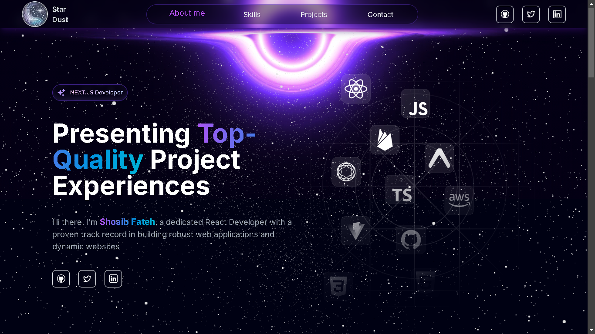

# Shoaib Fateh's Portfolio

Welcome to my personal portfolio! This web application showcases my previous projects, accomplishments, skills, and more, making it easy for you to see my work and connect with me.

## 🚀 Live Demo

Check out the live version of my portfolio here: [shoaibfateh21.vercel.app](https://shoaibfateh21.vercel.app)


## 🛠 Built With

- **React** - A JavaScript library for building user interfaces.
- **Tailwind CSS** - A utility-first CSS framework for rapid UI development.
- **Vercel** - For seamless deployment and hosting.

## Key Features

- **Responsive Design** - Accessible on all devices.
- **Project Showcase** - Display of my previous work and accomplishments.
- **Skills & CV** - Easily view my technical skills and download my CV.
- **Contact Information** - Get in touch with me directly.
- **Cool Animations** - Enjoy engaging animations throughout the portfolio for an enhanced user experience.

## 💻 Getting Started

To get a local copy up and running follow these simple steps:

1. Clone the repository:

   ```bash
   git clone https://github.com/shoaibfateh21/portfolio21.git
   ```

2. Navigate to the project directory:
   ```bash
   cd portfolio21
   ```
3. Install dependencies:
   ```bash
   npm install
   ```
4. Start the development server:
   ```bash
   npm run dev
   ```

## 🤝 Contributing

Contributions, issues, and feature requests are welcome! Feel free to check the [issues page](https://github.com/shoaibfateh21/portfolio21/issues) for more details.

## ⭐️ Show Your Support

If you like this project, follow me on GitHub and give it a star! Your support helps me build more cool stuff. Thank you!

---

For more information, feel free to contact me or check out my other projects. Happy browsing!
